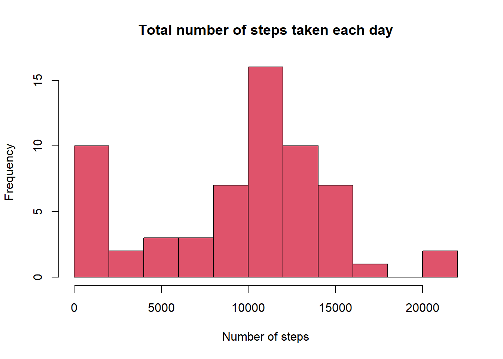
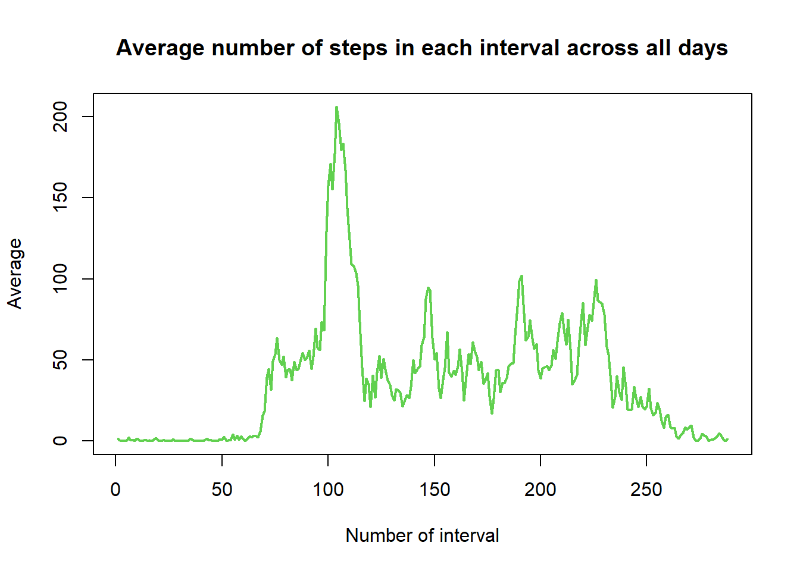
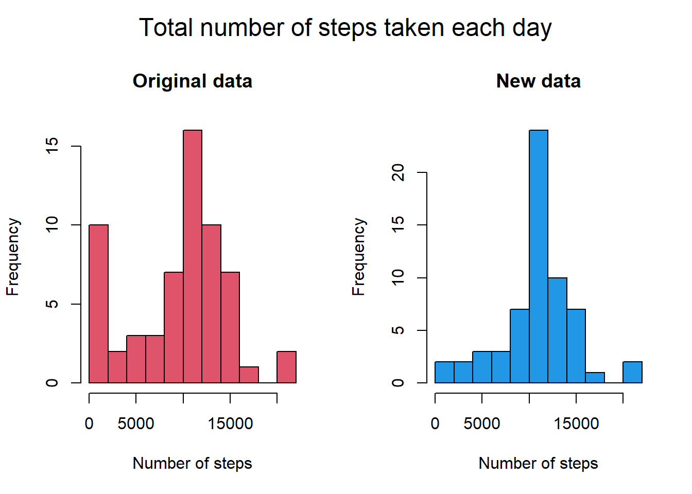

This assignment makes use of data from a personal activity monitoring device. This device collects data at 5 minute intervals through out the day. The data consists of two months of data from an anonymous individual collected during the months of October and November, 2012 and include the number of steps taken in 5 minute intervals each day.


## Loading and preprocessing the data

The very first step is to load the dataset.

```r
data=read.csv("./activity.csv")
```

Here are the first 5 rows of the dataset.

```r
head(data,5)
```

```
##   steps       date interval
## 1    NA 2012-10-01        0
## 2    NA 2012-10-01        5
## 3    NA 2012-10-01       10
## 4    NA 2012-10-01       15
## 5    NA 2012-10-01       20
```

Then, we add a little of format transforming the date variable to a Date/Time object.

```r
data$date=as.Date(data$date,format="%Y-%m-%d")
```

And we transform the 5-minutes intervals all to seconds.

```r
data$interval=(data$interval%/%100)*60+(data$interval%%100)
```


## What is mean total number of steps taken per day?

In order to answer this question, first we will calculate the number of steps by day.

```r
total=with(data,tapply(steps,date,sum,na.rm=T))
print(head(total))
```

```
## 2012-10-01 2012-10-02 2012-10-03 2012-10-04 2012-10-05 2012-10-06 
##          0        126      11352      12116      13294      15420
```

We plot the data into a histogram.

```r
with(data, hist(total, main="Total number of steps taken each day",xlab="Number of steps",breaks=10, col=2))
```

<!-- -->

Finally, we calculate the mean and median for the steps taken per day.

```r
mean=with(data,tapply(steps,date,mean, na.rm=T))
print(head(mean))
```

```
## 2012-10-01 2012-10-02 2012-10-03 2012-10-04 2012-10-05 2012-10-06 
##        NaN    0.43750   39.41667   42.06944   46.15972   53.54167
```

```r
median=with(data,tapply(steps,date,median, na.rm=T))
print(head(median))
```

```
## 2012-10-01 2012-10-02 2012-10-03 2012-10-04 2012-10-05 2012-10-06 
##         NA          0          0          0          0          0
```


## What is the average daily activity pattern?

First, we are going to calculate the average of steps taken by interval across all days.

```r
average=with(data,tapply(steps,interval,mean, na.rm=T))
print(head(average))
```

```
##         0         5        10        15        20        25 
## 1.7169811 0.3396226 0.1320755 0.1509434 0.0754717 2.0943396
```

Then, we are going to plot the time series of this data.

```r
serie.ts=ts(average)
plot(serie.ts,main="Average number of steps in each interval across all days",xlab="Number of interval",ylab="Average", col=3, lwd=2)
```

<!-- -->

As you can see, the maximum average of steps was made in the interval:

```r
average[match(max(average),average)]
```

```
##      515 
## 206.1698
```


## Imputing missing values

Now, we are going to study the missing values into the Database. In order to do that, the first step is to count the number of missing values inside the Steps column.

```r
table(is.na(data$steps))
```

```
## 
## FALSE  TRUE 
## 15264  2304
```

One way to manage missing values is filling them with the average value. So, we will fill those missing values with tha average of the interval it belongs, calculated across all days.

```r
na=which(is.na(data$steps))
for (i in na){
    inter=data$interval[i]
    av=average[names(average)==inter]
    data$steps[i]=av
}
```

We always have to check if all NA values have been filled.

```r
table(is.na(data$steps))
```

```
## 
## FALSE 
## 17568
```

Now, we can create a new database with no missing values, into a csv file.

```r
write.csv(data, file="NewBase.csv")
```

As you might imagine, if we re calculate the number of steps by day and the mean and median of the data, the values will be different from then original database. Let's check that.

```r
total1=with(data,tapply(steps,date,sum,na.rm=T))
print(head(total))
```

```
## 2012-10-01 2012-10-02 2012-10-03 2012-10-04 2012-10-05 2012-10-06 
##          0        126      11352      12116      13294      15420
```

We plot the original number of steps taken per day from the original data versus the new data to see how it changed.

```r
par(mfrow=c(1,2),oma = c(0, 0, 2, 0))
with(data, hist(total, main="Original data",xlab="Number of steps",breaks=10, col=2))
with(data, hist(total1, main="New data",xlab="Number of steps",breaks=10, col=4))
mtext("Total number of steps taken each day", outer = TRUE, cex = 1.5)
```

<!-- -->

Also, we can compare the mean and median of the original data versus the new data.

```r
mean2=with(data,tapply(steps,date,mean, na.rm=T))
print(head(mean2))
```

```
## 2012-10-01 2012-10-02 2012-10-03 2012-10-04 2012-10-05 2012-10-06 
##   37.38260    0.43750   39.41667   42.06944   46.15972   53.54167
```

```r
median2=with(data,tapply(steps,date,median, na.rm=T))
print(head(median2))
```

```
## 2012-10-01 2012-10-02 2012-10-03 2012-10-04 2012-10-05 2012-10-06 
##   34.11321    0.00000    0.00000    0.00000    0.00000    0.00000
```

The result is the following.

Mean:


```r
head(mean)
```

```
## 2012-10-01 2012-10-02 2012-10-03 2012-10-04 2012-10-05 2012-10-06 
##        NaN    0.43750   39.41667   42.06944   46.15972   53.54167
```

```r
head(mean2)
```

```
## 2012-10-01 2012-10-02 2012-10-03 2012-10-04 2012-10-05 2012-10-06 
##   37.38260    0.43750   39.41667   42.06944   46.15972   53.54167
```

Median:


```r
head(median)
```

```
## 2012-10-01 2012-10-02 2012-10-03 2012-10-04 2012-10-05 2012-10-06 
##         NA          0          0          0          0          0
```

```r
head(median2)
```

```
## 2012-10-01 2012-10-02 2012-10-03 2012-10-04 2012-10-05 2012-10-06 
##   34.11321    0.00000    0.00000    0.00000    0.00000    0.00000
```


## Are there differences in activity patterns between weekdays and weekends?

To answer this question, we will add a new factor to the database to categorise the dates as weekdays or weekends.

```r
data$day=weekdays.Date(data$date)
data$week=rep("weekday",nrow(data))
end=c("Sunday","Saturday")
end=which(data$day %in% end)
for (i in end){
    data$week[i]="weekend"
}
data$week=factor(data$week)
```

The number of weekdays and weekends are the following:

```r
print(table(data$week))
```

```
## 
## weekday weekend 
##   12960    4608
```

We subset the data by this new factor and calculate the average of steps taken by interval in each one of the categories.

```r
weekD=subset(data,week=="weekday")
weekE=subset(data,week=="weekend")
averageD=with(weekD,tapply(steps,interval,mean,rm.na=T))
averageE=with(weekE,tapply(steps,interval,mean,rm.na=T))
```

In order to see if there is a difference bewteen the pattern in weekdays and weekends, we are going to plot the time series of each one.

```r
serie.tsD=ts(averageD)
serie.tsE=ts(averageE)
par(mfrow=c(1,2),oma = c(0, 0, 2, 0))
plot(serie.tsD,main="Weekdays",xlab="Intervals",ylab="Average", col=5, lwd=1.5, xlim=range(pretty(c(0,288))))
plot(serie.tsE,main="Weekends",xlab="Intervals",ylab="Average", col=6, lwd=1.5, xlim=range(pretty(c(0,288))))
mtext("Average steps for each interval", outer = TRUE, cex = 1.5)
```

<!-- -->

As you can see, there is in fact a difference between the pattern in weekdays and weekends.
